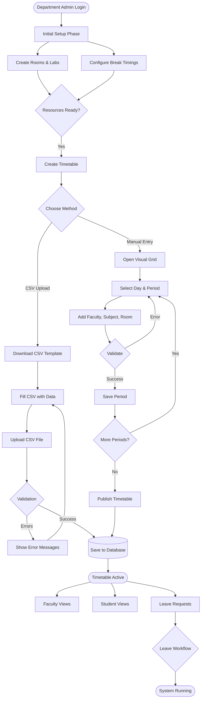
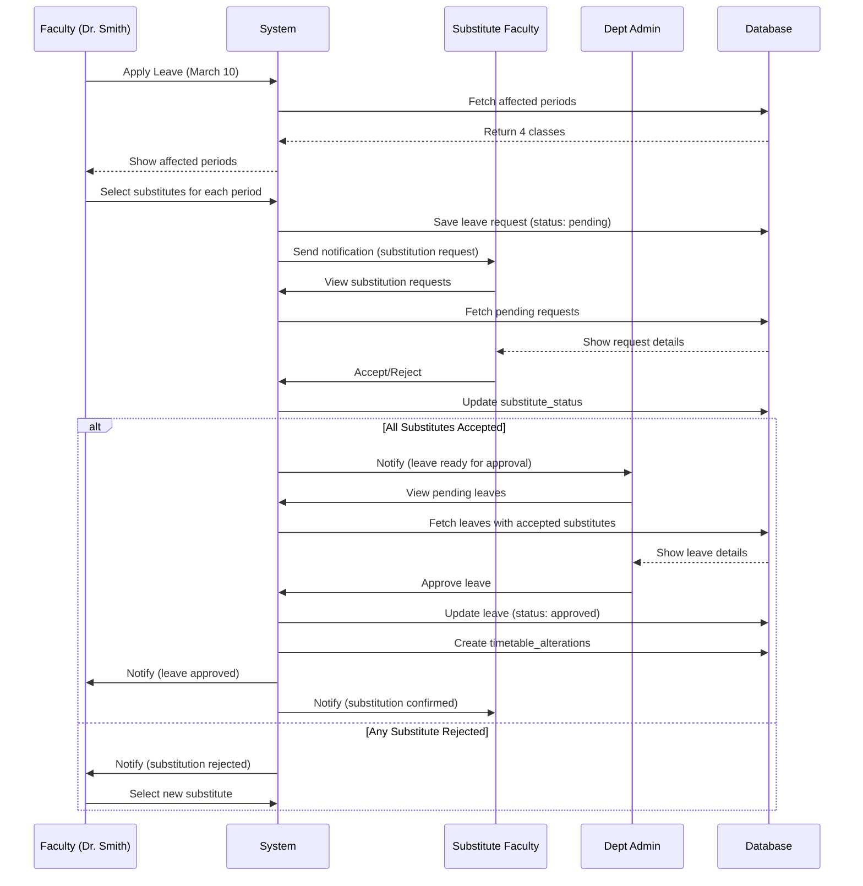
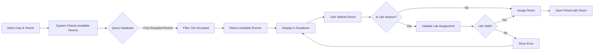
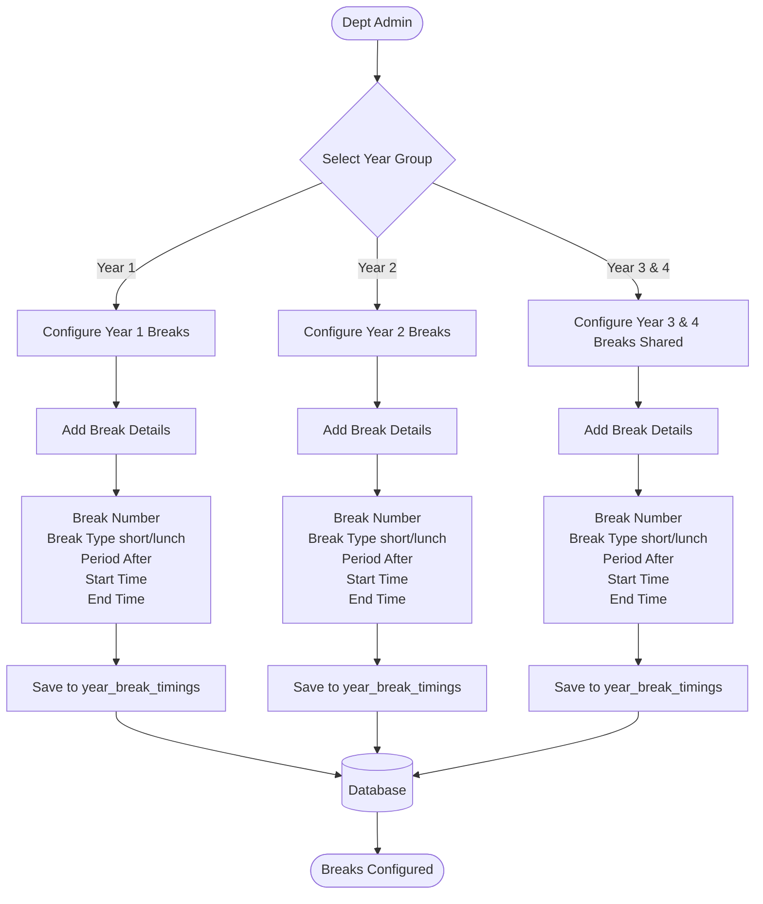
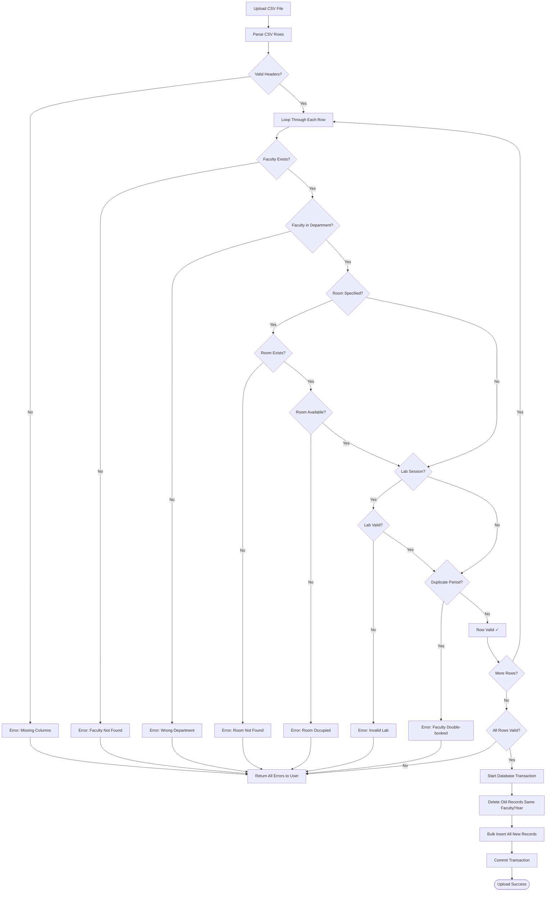
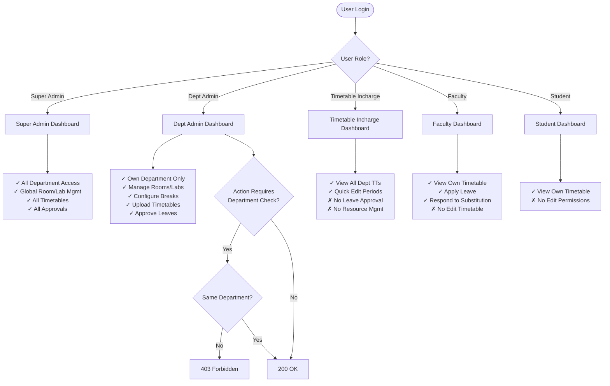
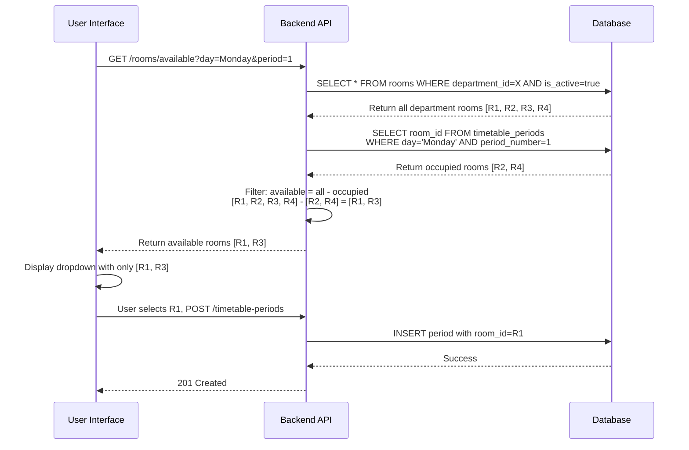
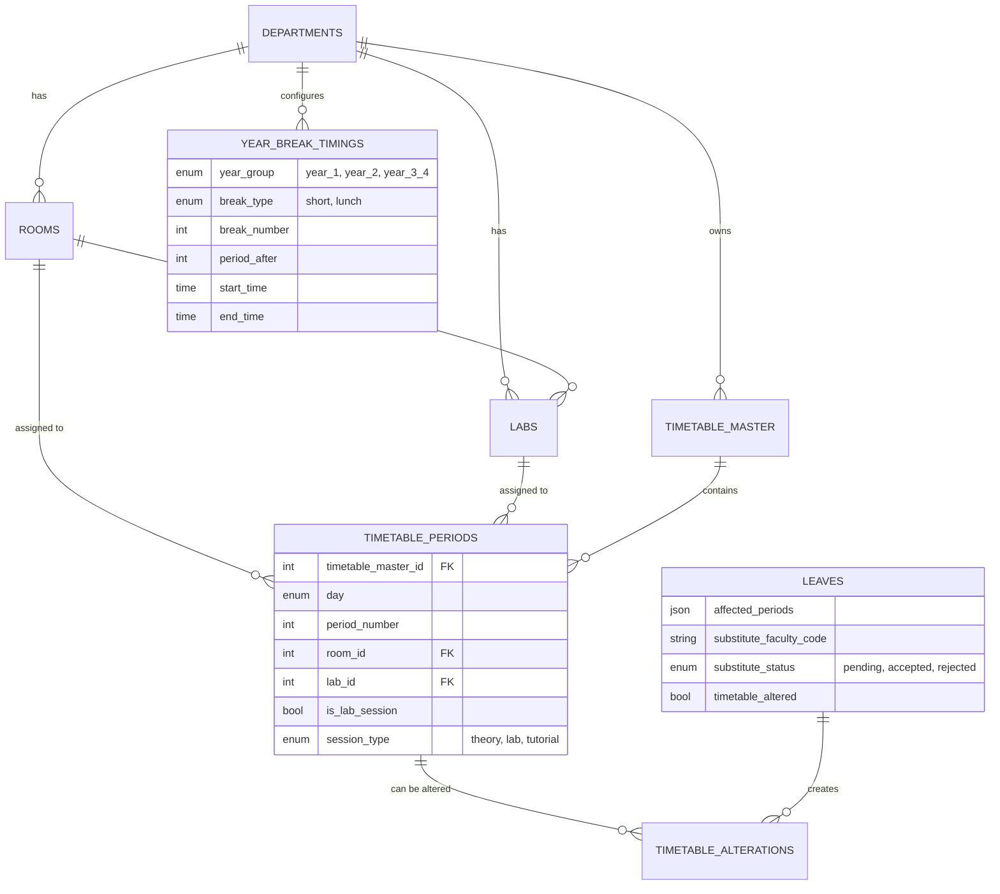
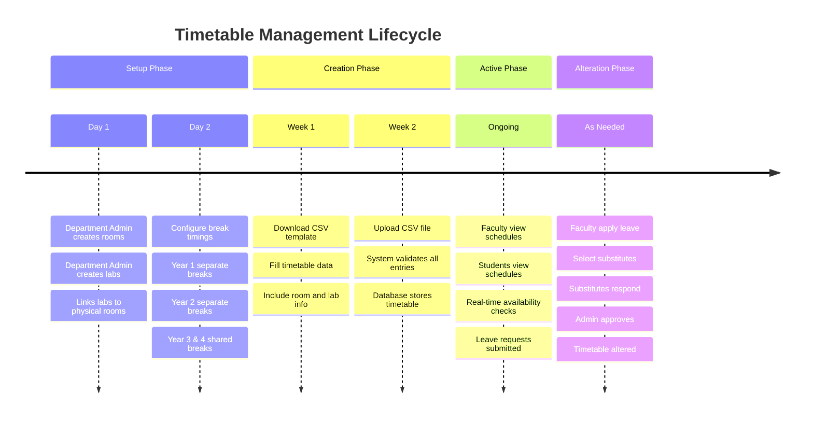

# Timetable System - Visual Flow Diagrams

## 📊 Complete System Architecture Flow



## 🔄 Leave Substitution Workflow



## 🏢 Room Allocation Flow



## 📅 Break Timing Configuration Flow



## 📤 CSV Upload Validation Flow



## 👥 User Role Permission Flow



## 🔍 Real-Time Availability Check Flow



## 📊 Database Relationships Flow



## 🎯 Complete Data Flow Timeline



---

## 🚦 Quick Reference: API Flow Patterns

### Pattern 1: Simple GET (No Complex Logic)
```
Frontend: GET /api/v1/department-admin/rooms
    ↓
Backend: Extract user from JWT → Filter by department → Query DB
    ↓
Database: SELECT * FROM rooms WHERE department_id = ?
    ↓
Backend: Format response → Return JSON
    ↓
Frontend: Display in table/grid
```

### Pattern 2: CREATE with Validation
```
Frontend: POST /api/v1/department-admin/labs { data }
    ↓
Backend: Authenticate → Authorize role → Validate data
    ↓
Validation Checks:
  - Lab code unique?
  - Room exists?
  - Room belongs to department?
  - Subject IDs valid?
    ↓
[If errors] → Return 400 with error messages
[If success] ↓
Database: INSERT INTO labs ...
    ↓
Backend: Return 201 Created with lab object
    ↓
Frontend: Show success message → Refresh list
```

### Pattern 3: Complex Workflow (Leave)
```
Frontend: POST /api/v1/faculty/leave/apply-with-substitute
    ↓
Backend Multi-Step:
  1. Validate leave dates
  2. Fetch affected timetable periods
  3. Validate substitute faculty
  4. Check substitute availability
  5. Start database transaction
  6. Insert leave record
  7. Update leave with substitutes
  8. Create notifications
  9. Commit transaction
    ↓
Database: Multiple tables updated atomically
    ↓
Notification Service: Send emails/push
    ↓
Backend: Return 200 with leave ID
    ↓
Frontend: Navigate to "My Leaves" → Show pending status
```

---

**These flows represent the complete, production-ready timetable management system!** 🎉
